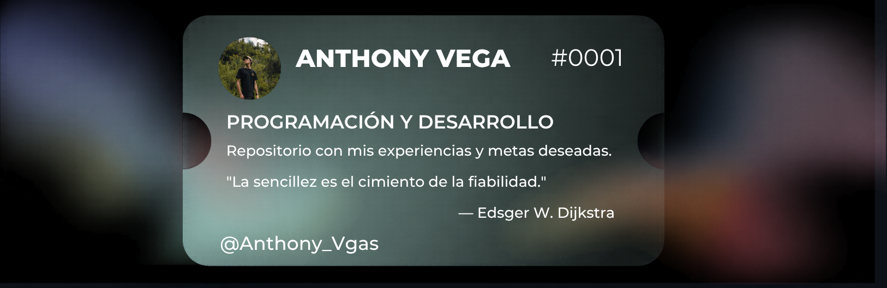

#  Bienvenid@ al GitHub de Anthony Vega

Soy estudiante de **Ingeniería de Sistemas en la Universidad Nacional de San Cristóbal de Huamanga (UNSCH)**, interesado en el desarrollo de soluciones tecnológicas que integren **software, inteligencia artificial, datos y automatización**. Me gusta desarrollar proyectos que me permitan entender no solo cómo programar una aplicación, sino también cómo diseñar su arquitectura, gestionar bases de datos, realizar pruebas, desplegar servicios y resolver problemas reales mediante tecnología. Actualmente estoy fortaleciendo mis conocimientos en **desarrollo Full Stack, arquitectura de software, inteligencia artificial aplicada, testing, DevOps y análisis de datos**. Mi objetivo es convertirme en un **Ingeniero de Software capaz de diseñar y desarrollar sistemas modernos, escalables y mantenibles**, integrando tecnologías de desarrollo, datos e inteligencia artificial.

# TECNOLOGÍAS 

## FRONTEND

## BACKEND

## BASES DE DATOS

## OTRAS TECNOLOGÍAS

